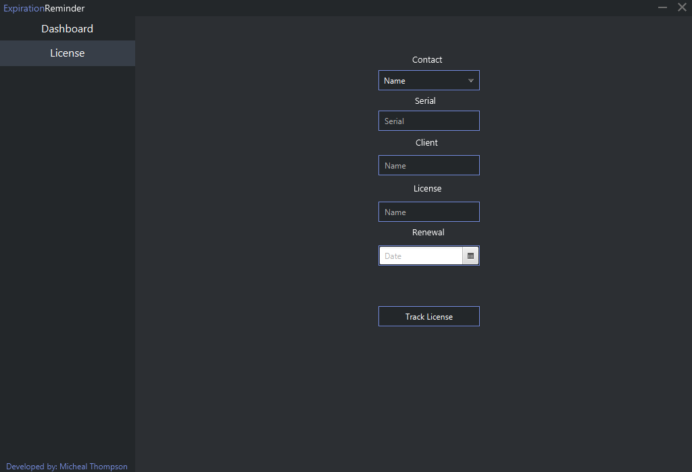

  <h1>ExpirationReminder - Desktop Application (JavaFX)</h1>

  Author: Micheal Thompson

#### Features
 - A clean and user-friendly UI using JavaFX.
 - Tracks licenses information such as Serial, License Owner, Renewal Date.
 - Sends out emails to assigned contact if less than 30, 14, 7, 1 days left on license.

#### Dependencies 
 * **gson**
 * **javax.mail**
 * **lombok**
 
 
